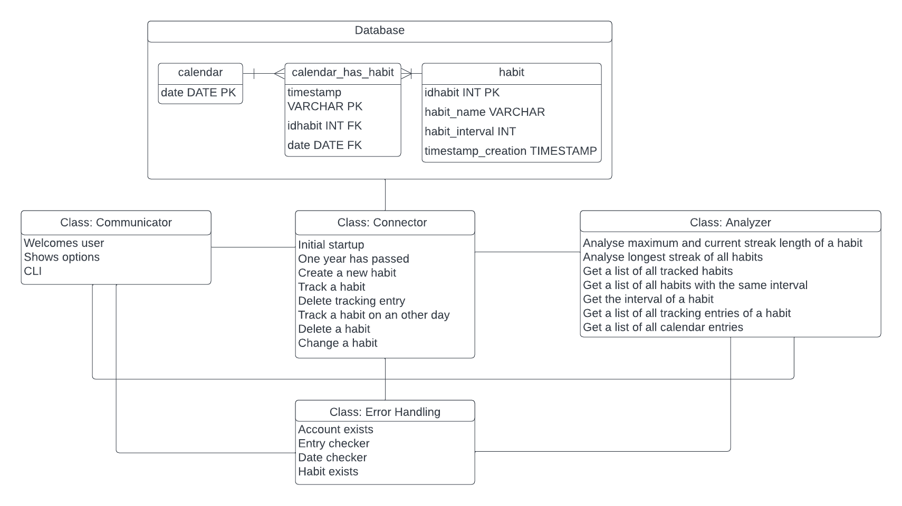

# Habit Tracker

Welcome to my Habit Tracker! This project was developed as part of the course ‘Object Oriented and Functional Programming’ with Python under the supervision of Prof. Dr. Max Pumperla at the IU. The program allows users to create, manage, and track habits over time. The program also allows users to determine the current streak length and the longest streak length of a habit, as well as the habit with the longest streak length of all.

## Installation

In order to ensure a consistent and reproducible development environment for this project, a virtual environment named ‘habit_tracker_env” has been created with Python 3.10.9. If you want, you can create the environment from the ‘habit_tracker_env.yml’.

```bash
$ conda env create -f habit_tracker_env.yml
$ conda activate habit_tracker_env
```

# Program Installation and Usage Guide

## Installation

To install the program, follow these steps:

1. Clone the repository to your computer.
2. Run the `habit_tracker.py` file in your Python terminal.

## Usage and Testing

1. Place `habit_tracker.py` in the same directory as your `habit_tracker.db` file.
2. Run `habit_tracker.py` in your terminal.
3. Follow the menu options; they are self-explanatory.
4. For a fresh start, choose option 1 (beware of potential errors in the testing after deleting the database).
5. Beware that you might need to scroll up to see your results hence the menu reloads.

### Testing Functionalities

Use the `test_habit_tracker_test.py` Python file and the corresponding `habit_tracker.db` for automated tests written in pytest.

**Attention:** Changes to the `habit_tracker.db` may disrupt automated tests, as they are adapted to the original database state.

### Data Generation

To enable testing, the program generates test data for two months using `habit_tracker_test_data_creation.py`. Be cautious, as this script fills the database with randomized data, making testing improper afterward.

## How it Works



### Main Classes

The program consists of four classes: `Connector`, `Analyzer`, `Error Handling`, and `Communicator`.

#### Connector

The `Connector` class establishes a connection to the SQLite database (`habit_tracker.db`) and enables data entry, modification, and deletion. It offers functions for creating new habits, tracking habits, and more.

#### Analyzer

The `Analyzer` class analyzes data from the database, including streak analyses. Functions allow viewing tracking entries, calendar dates, and habits with the same interval.

#### Error Handling

The `Error Handling` class prevents program crashes due to incorrect user input. Functions like `habit_exists` check if a habit entered by a user exists in the database.

#### Communicator

The `Communicator` class handles user communication, providing clear instructions and guiding users through options. It continuously runs until the user chooses to exit (Option 0).

